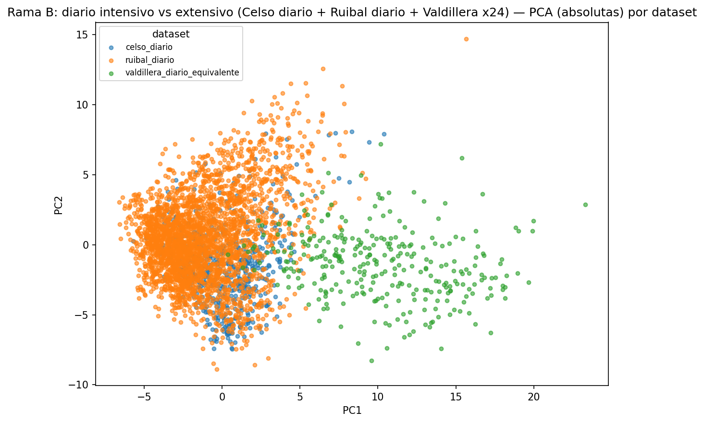
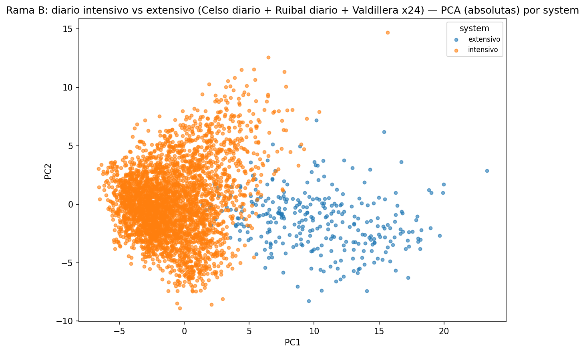
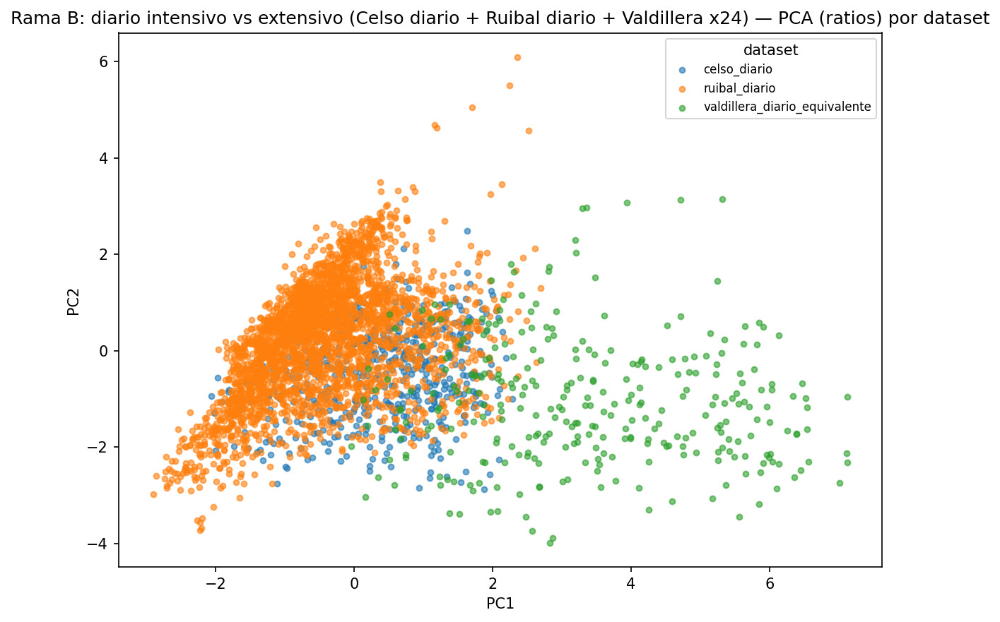
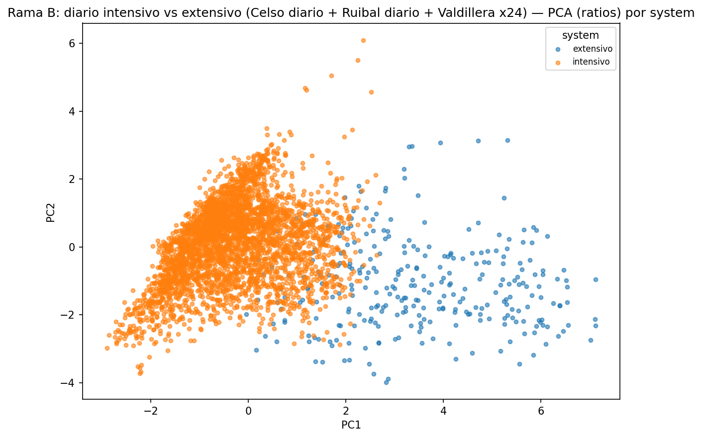
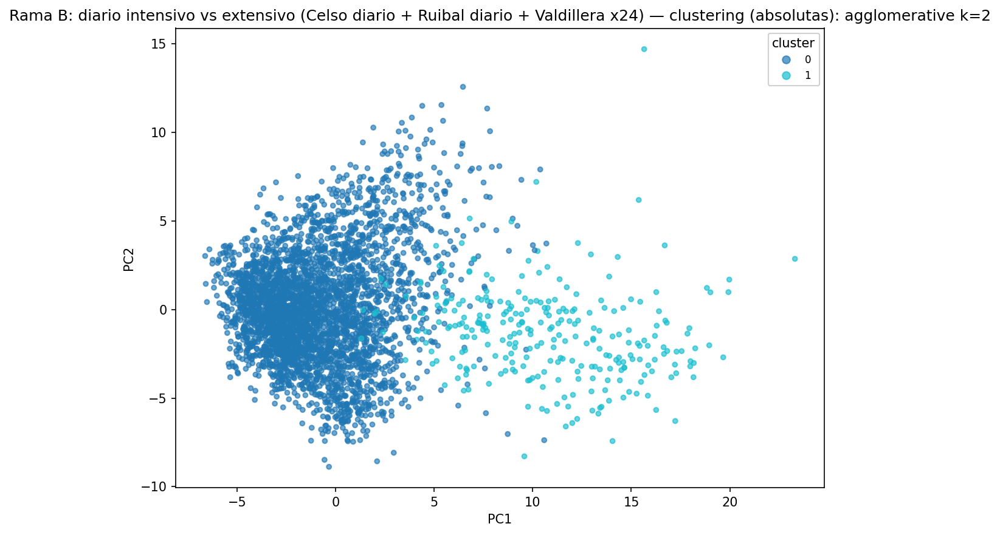
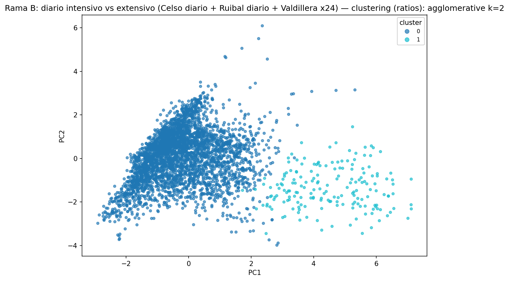

# Informe de analisis — Rama B: diario intensivo vs extensivo (Celso diario + Ruibal diario + Valdillera x24)

Este informe se genera automaticamente a partir de `codigo/pca_ramas.py` y `codigo/clustering_ramas.py`, y documenta el analisis de componentes principales (PCA) y clustering realizado sobre las features semanales de esta rama. La fase de reduccion dimensional avanzada (t-SNE, UMAP) y clustering comparativo que amplia estos resultados se documenta por separado en `reduccion_avanzada/informe_reduccion_avanzada_rama_b_diario_sistemas.md`.

Numero de filas de features analizadas: 3,714.

## Analisis de componentes principales (PCA)

### Variables absolutas (54 variables de entrada)
Varianza explicada: PC1=31.9%, PC2=17.8%, acumulada=49.8%.
Variables con mayor peso en PC1: `walk_mean` (+0.21), `walk_p90` (+0.20), `walk_median` (+0.20), `walk_p10` (+0.19), `steps_mean` (+0.19).
eta² (`system`, PC1) = 0.549; eta² (`dataset`, PC1) = 0.563 (proporcion de la varianza de PC1 atribuible a cada agrupacion).

### Variables ratios (5 variables de entrada)
Varianza explicada: PC1=44.0%, PC2=30.3%, acumulada=74.3%.
Variables con mayor peso en PC1: `ratio_graze` (+0.58), `ratio_eat` (-0.54), `ratio_walk` (+0.45), `ratio_ruminate` (-0.38), `ratio_rest` (+0.17).
eta² (`system`, PC1) = 0.483; eta² (`dataset`, PC1) = 0.524 (proporcion de la varianza de PC1 atribuible a cada agrupacion).

## Clustering

### Variables absolutas
Configuracion con mayor silhouette score: **agglomerative**, k=2.
silhouette=0.439 (valores mas altos indican clusters mejor separados), Davies-Bouldin=1.180 (valores mas bajos indican mejor separacion), Calinski-Harabasz=879.1 (valores mas altos indican mejor separacion).
Pureza media por vaca (fraccion de semanas de una misma vaca asignadas a su cluster dominante): 97.0%.

Distribucion de clusters por `dataset`:

|    |   celso_diario |   ruibal_diario |   valdillera_diario_equivalente |
|---:|---------------:|----------------:|--------------------------------:|
|  0 |            562 |            2841 |                              32 |
|  1 |              0 |               1 |                             278 |

Distribucion de clusters por `system`:

|    |   extensivo |   intensivo |
|---:|------------:|------------:|
|  0 |          32 |        3403 |
|  1 |         278 |           1 |

Metricas completas para todas las combinaciones de algoritmo y k evaluadas: `clustering_rama_b_diario_sistemas_absolutas_metricas.csv`.

### Variables ratios
Configuracion con mayor silhouette score: **agglomerative**, k=2.
silhouette=0.540 (valores mas altos indican clusters mejor separados), Davies-Bouldin=0.736 (valores mas bajos indican mejor separacion), Calinski-Harabasz=1178.8 (valores mas altos indican mejor separacion).
Pureza media por vaca (fraccion de semanas de una misma vaca asignadas a su cluster dominante): 89.8%.

Distribucion de clusters por `dataset`:

|    |   celso_diario |   ruibal_diario |   valdillera_diario_equivalente |
|---:|---------------:|----------------:|--------------------------------:|
|  0 |            562 |            2842 |                             127 |
|  1 |              0 |               0 |                             183 |

Distribucion de clusters por `system`:

|    |   extensivo |   intensivo |
|---:|------------:|------------:|
|  0 |         127 |        3404 |
|  1 |         183 |           0 |

Metricas completas para todas las combinaciones de algoritmo y k evaluadas: `clustering_rama_b_diario_sistemas_ratios_metricas.csv`.
