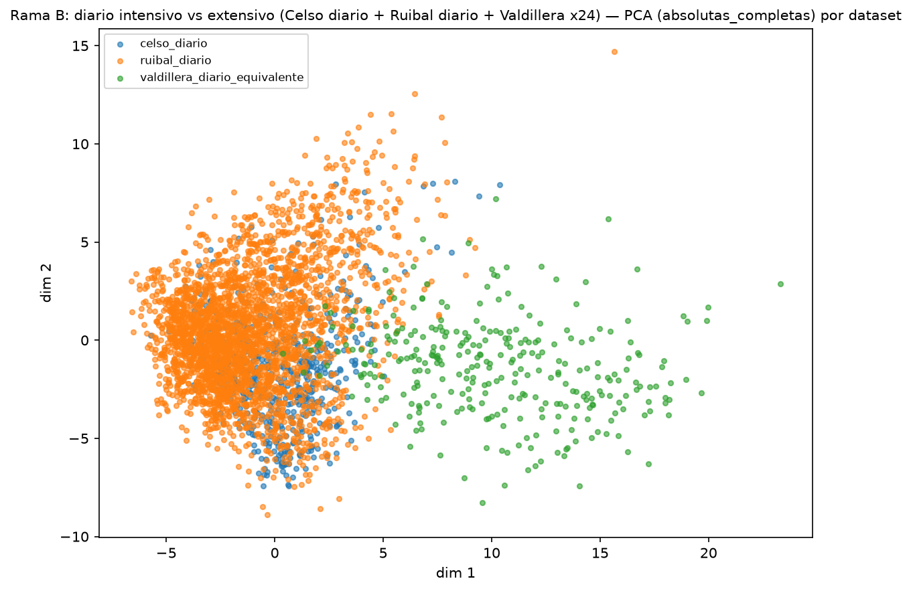
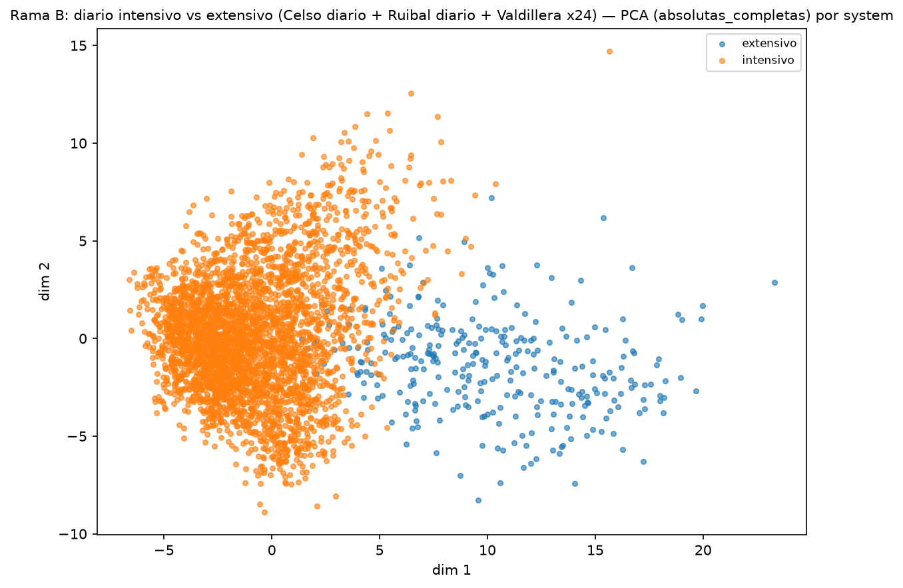
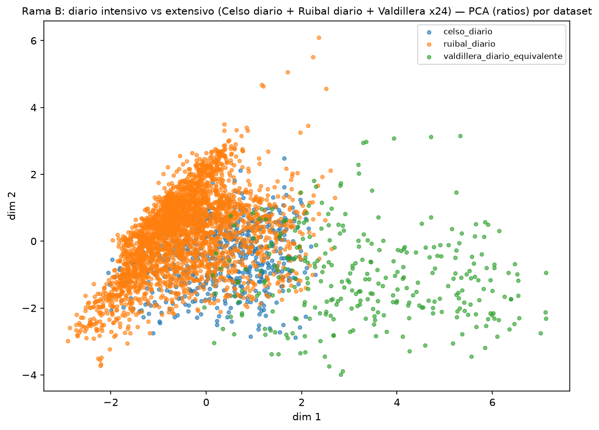
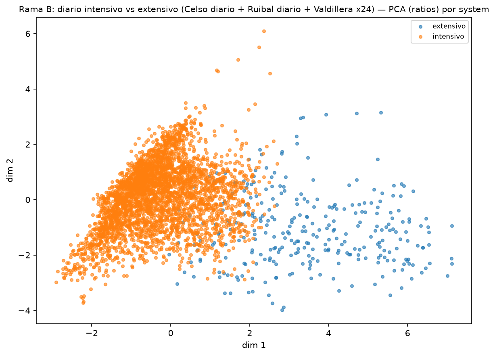
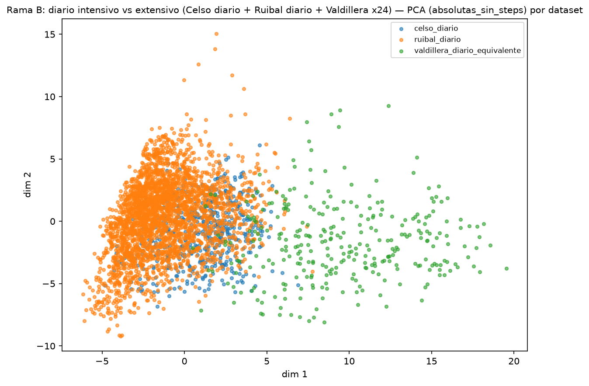
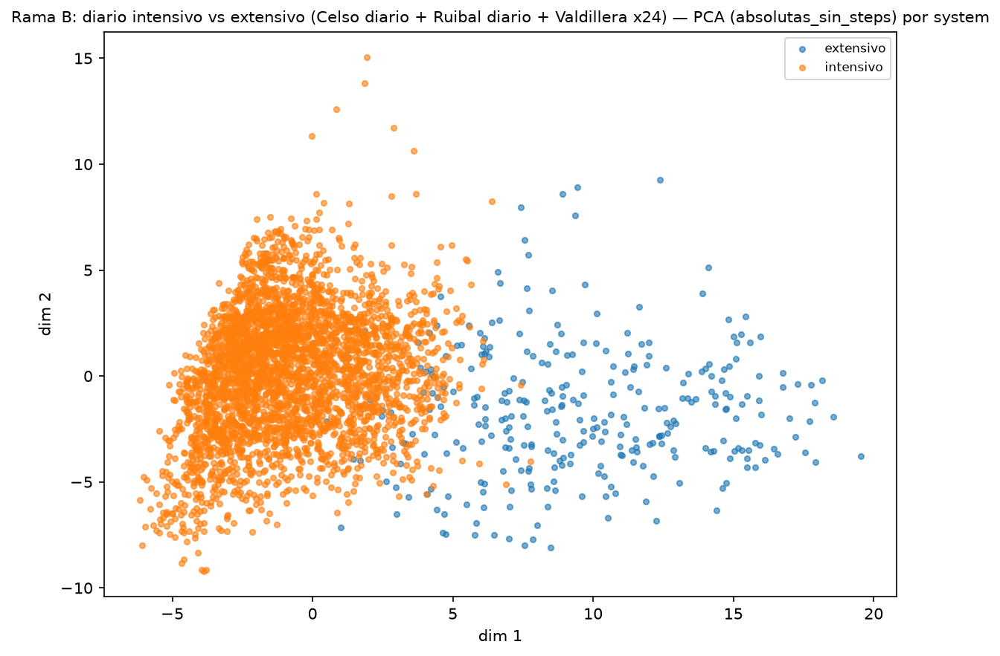

# Reduccion dimensional avanzada y clustering comparativo — Rama B: diario intensivo vs extensivo (Celso diario + Ruibal diario + Valdillera x24)

Este informe se genera automaticamente a partir de `codigo/reduccion_clustering_avanzado.py` y documenta la fase de reduccion dimensional no lineal (t-SNE, UMAP) y clustering comparativo que amplia el analisis de componentes principales (PCA) descrito en `informe_rama_b_diario_sistemas.md`.

**Alcance metodologico.** PCA, t-SNE y UMAP se aplican de forma no supervisada: en ningun caso se utiliza la etiqueta `system` (ni `dataset` ni `cow_id`) como variable de entrada. Estos metadatos se emplean unicamente a posteriori, para colorear las proyecciones e interpretar los resultados. PCA se mantiene como tecnica de referencia por ser la unica que ofrece loadings directamente interpretables; t-SNE y UMAP se presentan como visualizaciones complementarias de la estructura local de los datos, no como evidencia definitiva de separacion entre sistemas de produccion: ambas tecnicas distorsionan las distancias globales y su resultado depende de los hiperparametros elegidos, por lo que se documentan varias configuraciones en lugar de una unica proyeccion seleccionada a posteriori.

Tecnicas de reduccion evaluadas: PCA; t-SNE con perplexity [5, 10, 30, 50] (learning_rate='auto', random_state fijo); UMAP con n_neighbors [10, 15, 30, 50] y min_dist [0.0, 0.1, 0.5] (random_state fijo).
Tecnicas de clustering evaluadas: K-Means, Agglomerative Clustering y Gaussian Mixture (k=2..6), y DBSCAN (eps derivado de los percentiles [50, 75, 90] de la distancia al k-esimo vecino, min_samples [5, 10]), sobre tres espacios: variables originales estandarizadas, proyeccion PCA (2D) y proyeccion UMAP (2D).

**Criterio de presentacion de resultados.** Por cada conjunto de variables se distingue entre el resultado principal — clustering sobre la proyeccion PCA, por ser el espacio interpretable mediante loadings — y resultados exploratorios — clustering sobre el espacio original de alta dimension y sobre la proyeccion UMAP. Dentro de los resultados exploratorios, las configuraciones de DBSCAN que producen mas de 10 microclusters o mas de un 15% de puntos marcados como ruido se reportan como exploratorias y se excluyen como candidatas a resultado principal, con independencia de su silhouette score.

## absolutas_completas — 54 variables, 3714 filas (conjunto de variables)

### Componentes principales (PCA)
Varianza explicada: PC1=31.9%, PC2=17.8%.

El primer componente principal esta dominado por estadisticos de las variables de comportamiento `walk`, `steps`, con el mayor peso (+0.21, signo positivo) en `walk_mean`. Esto indica que la direccion de mayor varianza en el conjunto de variables `absolutas_completas` esta asociada principalmente a diferencias en el tiempo/intensidad de estos comportamientos entre registros, mas que a las demas variables incluidas en el analisis, que contribuyen en menor medida a PC1.

Variables con mayor peso en PC1: `walk_mean` (+0.21), `walk_p90` (+0.20), `walk_median` (+0.20), `walk_p10` (+0.19), `steps_mean` (+0.19).

### t-SNE (visualizacion complementaria)
Perplexities evaluadas: [5, 10, 30, 50]. Divergencia KL final por perplexity: 5=1.67, 10=1.73, 30=1.64, 50=1.53. Un valor de KL mas bajo indica un mejor ajuste de esa proyeccion concreta a las distancias locales originales, pero no es comparable de forma absoluta entre perplexities distintas ni constituye una medida de calidad de clustering.
Grafica comparativa de las 4 perplexities: `absolutas_completas_tsne_grid_por_system.png`.
Grafica principal (perplexity=30): `absolutas_completas_tsne_por_dataset.png`, `absolutas_completas_tsne_por_system.png`.

### UMAP (visualizacion complementaria)
Combinaciones evaluadas (n_neighbors, min_dist): [[10, 0.0], [10, 0.1], [10, 0.5], [15, 0.0], [15, 0.1], [15, 0.5], [30, 0.0], [30, 0.1], [30, 0.5], [50, 0.0], [50, 0.1], [50, 0.5]].
Grafica comparativa de las 12 combinaciones: `absolutas_completas_umap_grid_por_system.png`.
Grafica principal (n_neighbors=15, min_dist=0.1): `absolutas_completas_umap_por_dataset.png`, `absolutas_completas_umap_por_system.png`.

### Resultado principal: clustering sobre la proyeccion PCA

Mejor configuracion segun silhouette: **gmm** (k=2). silhouette=0.515, Davies-Bouldin=1.016, Calinski-Harabasz=2417.5, n_clusters=2, pureza media por vaca=90.8%.
Relacion con `system`: correspondencia fuerte con `system` (>85% de cada categoria concentrado en un unico cluster).
Relacion con `dataset`: correspondencia fuerte con `dataset` (>85% de cada categoria concentrado en un unico cluster).
Figura: `absolutas_completas_clustering_pca_scatter.png`. Asignacion por vaca: `absolutas_completas_clustering_pca_por_vaca.csv`.

### Resultados exploratorios: espacio original de variables y proyeccion UMAP

| Espacio | Algoritmo | Parametros | n_clusters | n_noise | silhouette | Davies-Bouldin | Calinski-Harabasz | Pureza media/vaca | Observacion |
|---|---|---|---:|---:|---:|---:|---:|---:|---|
| original_escalado | dbscan | eps=5.193, min_samples=5 (p90) | 3 | 246 | 0.466 | 0.828 | 52.4 | 87.2% |  |
| umap | kmeans | k=5 | 5 | 0 | 0.481 | 0.639 | 5482.2 | 80.8% |  |

Las metricas completas para todas las combinaciones de algoritmo/parametros evaluadas en cada espacio se encuentran en `absolutas_completas_clustering_<espacio>_metricas.csv`.

## ratios — 5 variables, 3714 filas (analisis de sensibilidad (ratios))

### Componentes principales (PCA)
Varianza explicada: PC1=44.0%, PC2=30.3%.

El primer componente principal esta dominado por estadisticos de las variables de comportamiento `graze`, `eat`, `walk`, `ruminate`, `rest`, con el mayor peso (+0.58, signo positivo) en `ratio_graze`. Esto indica que la direccion de mayor varianza en el conjunto de variables `ratios` esta asociada principalmente a diferencias en el tiempo/intensidad de estos comportamientos entre registros, mas que a las demas variables incluidas en el analisis, que contribuyen en menor medida a PC1.

Variables con mayor peso en PC1: `ratio_graze` (+0.58), `ratio_eat` (-0.54), `ratio_walk` (+0.45), `ratio_ruminate` (-0.38), `ratio_rest` (+0.17).

### t-SNE (visualizacion complementaria)
Perplexities evaluadas: [5, 10, 30, 50]. Divergencia KL final por perplexity: 5=1.13, 10=1.19, 30=1.15, 50=1.08. Un valor de KL mas bajo indica un mejor ajuste de esa proyeccion concreta a las distancias locales originales, pero no es comparable de forma absoluta entre perplexities distintas ni constituye una medida de calidad de clustering.
Grafica comparativa de las 4 perplexities: `ratios_tsne_grid_por_system.png`.
Grafica principal (perplexity=30): `ratios_tsne_por_dataset.png`, `ratios_tsne_por_system.png`.

### UMAP (visualizacion complementaria)
Combinaciones evaluadas (n_neighbors, min_dist): [[10, 0.0], [10, 0.1], [10, 0.5], [15, 0.0], [15, 0.1], [15, 0.5], [30, 0.0], [30, 0.1], [30, 0.5], [50, 0.0], [50, 0.1], [50, 0.5]].
Grafica comparativa de las 12 combinaciones: `ratios_umap_grid_por_system.png`.
Grafica principal (n_neighbors=15, min_dist=0.1): `ratios_umap_por_dataset.png`, `ratios_umap_por_system.png`.

### Resultado principal: clustering sobre la proyeccion PCA

Mejor configuracion segun silhouette: **kmeans** (k=2). silhouette=0.440, Davies-Bouldin=1.013, Calinski-Harabasz=2094.4, n_clusters=2, pureza media por vaca=94.5%.
Relacion con `system`: correspondencia fuerte con `system` (>85% de cada categoria concentrado en un unico cluster).
Relacion con `dataset`: sin correspondencia clara con `dataset` (particion distribuida entre clusters sin un patron dominante).
Figura: `ratios_clustering_pca_scatter.png`. Asignacion por vaca: `ratios_clustering_pca_por_vaca.csv`.

### Resultados exploratorios: espacio original de variables y proyeccion UMAP

| Espacio | Algoritmo | Parametros | n_clusters | n_noise | silhouette | Davies-Bouldin | Calinski-Harabasz | Pureza media/vaca | Observacion |
|---|---|---|---:|---:|---:|---:|---:|---:|---|
| original_escalado | agglomerative | k=2 | 2 | 0 | 0.540 | 0.736 | 1178.8 | 89.8% |  |
| umap | dbscan | eps=0.121, min_samples=5 (p50) | 197 | 1209 | 0.551 | 0.504 | 11836.4 | 41.4% | excluido como resultado principal: DBSCAN genera un numero elevado de microclusters o una fraccion de ruido por encima del umbral de interpretabilidad; se reporta unicamente con fines exploratorios. |

Las metricas completas para todas las combinaciones de algoritmo/parametros evaluadas en cada espacio se encuentran en `ratios_clustering_<espacio>_metricas.csv`.

## absolutas_sin_steps — 45 variables, 3714 filas (conjunto de variables)

### Componentes principales (PCA)
Varianza explicada: PC1=32.3%, PC2=19.7%.

El primer componente principal esta dominado por estadisticos de las variables de comportamiento `graze`, con el mayor peso (+0.23, signo positivo) en `graze_max`. Esto indica que la direccion de mayor varianza en el conjunto de variables `absolutas_sin_steps` esta asociada principalmente a diferencias en el tiempo/intensidad de estos comportamientos entre registros, mas que a las demas variables incluidas en el analisis, que contribuyen en menor medida a PC1.

Variables con mayor peso en PC1: `graze_max` (+0.23), `graze_p90` (+0.23), `graze_mean` (+0.23), `graze_median` (+0.23), `graze_std` (+0.21).

### t-SNE (visualizacion complementaria)
Perplexities evaluadas: [5, 10, 30, 50]. Divergencia KL final por perplexity: 5=1.72, 10=1.80, 30=1.71, 50=1.59. Un valor de KL mas bajo indica un mejor ajuste de esa proyeccion concreta a las distancias locales originales, pero no es comparable de forma absoluta entre perplexities distintas ni constituye una medida de calidad de clustering.
Grafica comparativa de las 4 perplexities: `absolutas_sin_steps_tsne_grid_por_system.png`.
Grafica principal (perplexity=30): `absolutas_sin_steps_tsne_por_dataset.png`, `absolutas_sin_steps_tsne_por_system.png`.

### UMAP (visualizacion complementaria)
Combinaciones evaluadas (n_neighbors, min_dist): [[10, 0.0], [10, 0.1], [10, 0.5], [15, 0.0], [15, 0.1], [15, 0.5], [30, 0.0], [30, 0.1], [30, 0.5], [50, 0.0], [50, 0.1], [50, 0.5]].
Grafica comparativa de las 12 combinaciones: `absolutas_sin_steps_umap_grid_por_system.png`.
Grafica principal (n_neighbors=15, min_dist=0.1): `absolutas_sin_steps_umap_por_dataset.png`, `absolutas_sin_steps_umap_por_system.png`.

### Resultado principal: clustering sobre la proyeccion PCA

Mejor configuracion segun silhouette: **agglomerative** (k=2). silhouette=0.602, Davies-Bouldin=0.622, Calinski-Harabasz=2190.3, n_clusters=2, pureza media por vaca=94.3%.
Relacion con `system`: correspondencia moderada con `system` (entre 79% y 100% de cada categoria en un unico cluster, con solape no despreciable).
Relacion con `dataset`: correspondencia moderada con `dataset` (entre 79% y 100% de cada categoria en un unico cluster, con solape no despreciable).
Figura: `absolutas_sin_steps_clustering_pca_scatter.png`. Asignacion por vaca: `absolutas_sin_steps_clustering_pca_por_vaca.csv`.

### Resultados exploratorios: espacio original de variables y proyeccion UMAP

| Espacio | Algoritmo | Parametros | n_clusters | n_noise | silhouette | Davies-Bouldin | Calinski-Harabasz | Pureza media/vaca | Observacion |
|---|---|---|---:|---:|---:|---:|---:|---:|---|
| original_escalado | dbscan | eps=5.141, min_samples=10 (p90) | 3 | 204 | 0.523 | 0.833 | 82.9 | 87.8% |  |
| umap | gmm | k=2 | 2 | 0 | 0.561 | 0.423 | 2405.0 | 98.7% |  |

Las metricas completas para todas las combinaciones de algoritmo/parametros evaluadas en cada espacio se encuentran en `absolutas_sin_steps_clustering_<espacio>_metricas.csv`.

## Limitaciones de interpretacion

- t-SNE y UMAP no preservan distancias globales entre grupos; la distancia visual entre clusters en estas proyecciones no debe interpretarse como una medida de disimilitud.
- El resultado de t-SNE y UMAP depende de la semilla aleatoria y de los hiperparametros empleados; el barrido de valores utilizado es representativo pero no exhaustivo.
- El parametro `eps` de DBSCAN se deriva de percentiles de la distancia al k-esimo vecino (heuristica de codo) y no de una busqueda exhaustiva; las configuraciones con muy pocos puntos no clasificados como ruido se descartan de la evaluacion de silhouette/Davies-Bouldin/Calinski-Harabasz.
- La pureza por vaca puede resultar elevada como consecuencia de la autocorrelacion temporal entre semanas consecutivas de una misma vaca, y no necesariamente refleja un patron biologico independiente de esa autocorrelacion; no se ha aplicado ninguna correccion por esta dependencia.
