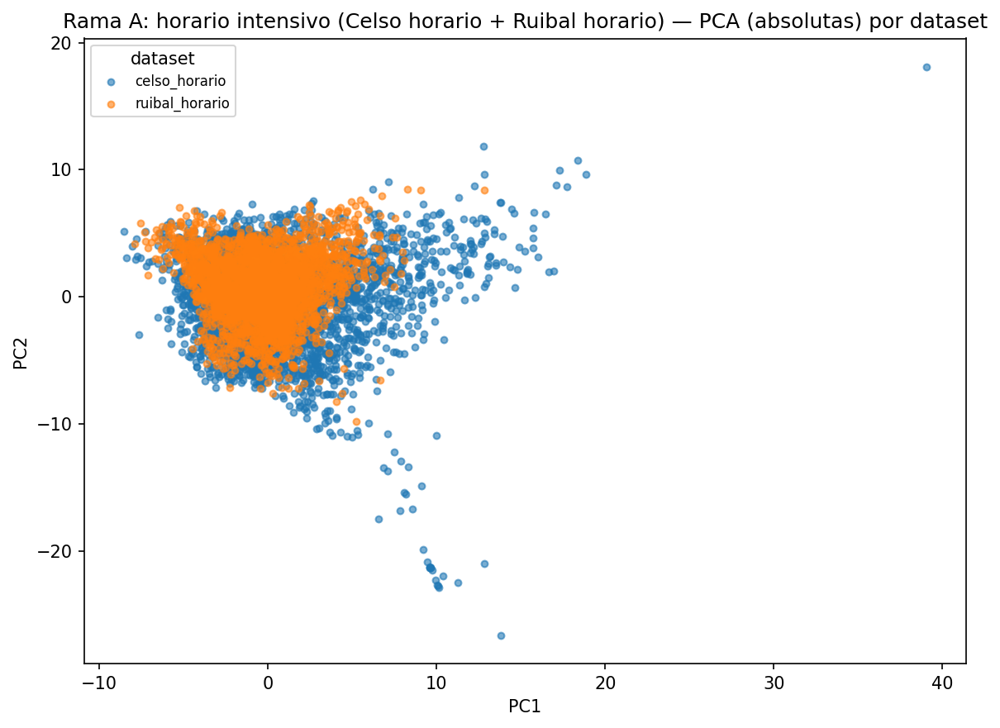
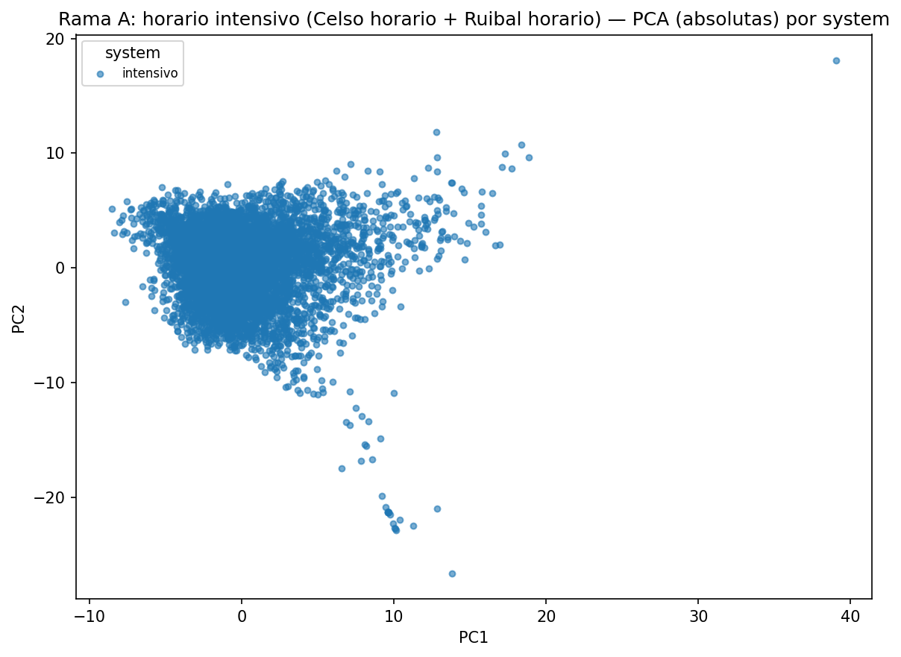
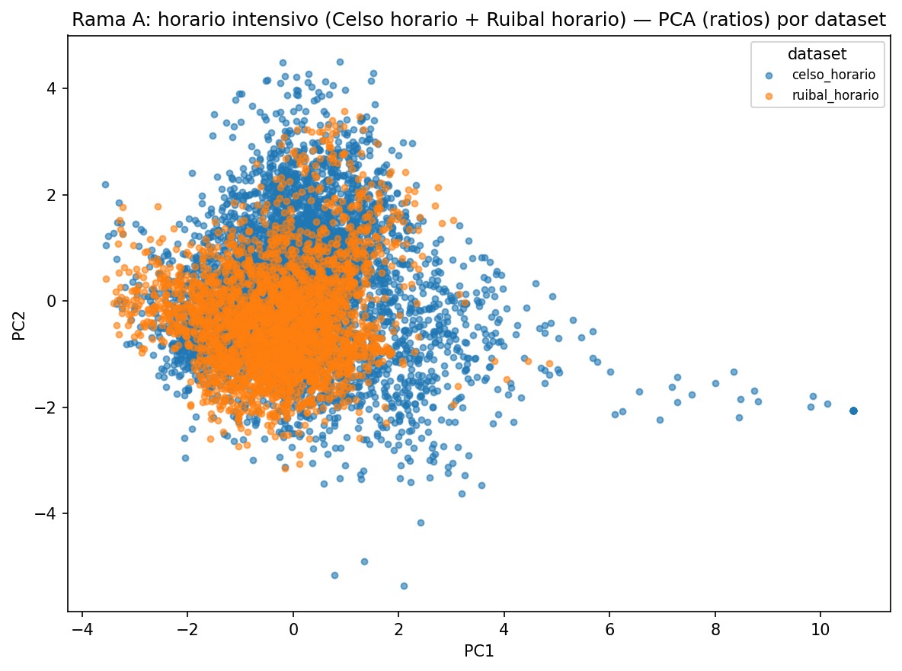
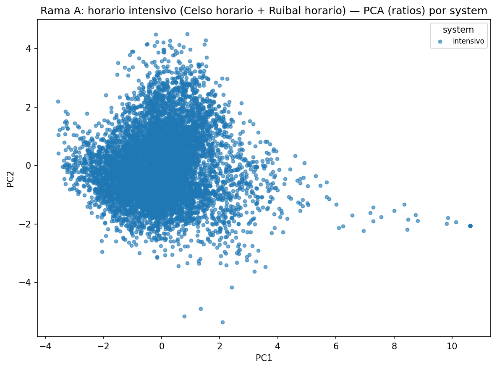
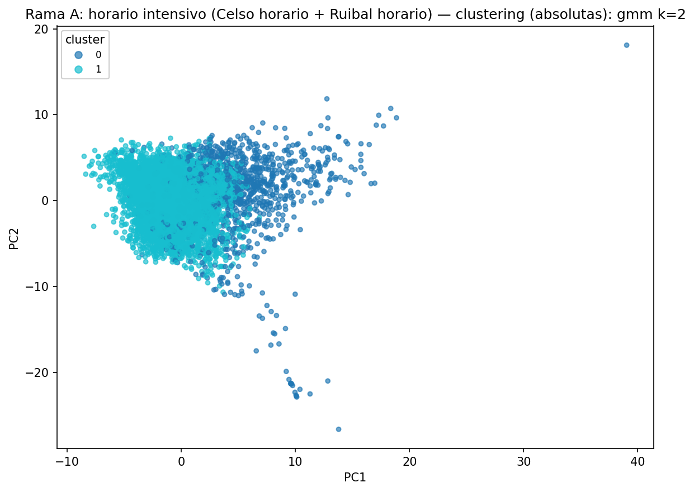
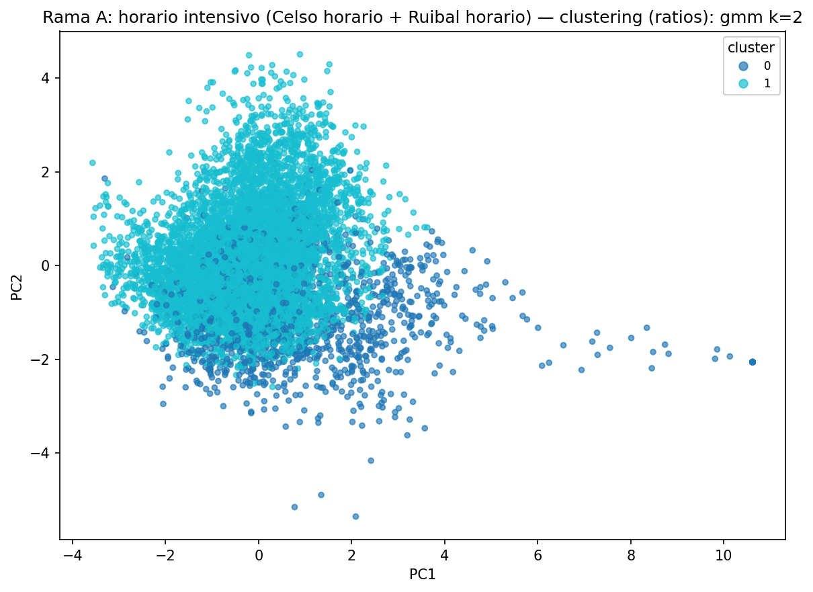

# Informe de analisis — Rama A: horario intensivo (Celso horario + Ruibal horario)

Este informe se genera automaticamente a partir de `codigo/pca_ramas.py` y `codigo/clustering_ramas.py`, y documenta el analisis de componentes principales (PCA) y clustering realizado sobre las features semanales de esta rama. La fase de reduccion dimensional avanzada (t-SNE, UMAP) y clustering comparativo que amplia estos resultados se documenta por separado en `reduccion_avanzada/informe_reduccion_avanzada_rama_a_horario_intensivo.md`.

Numero de filas de features analizadas: 7,402.

## Analisis de componentes principales (PCA)

### Variables absolutas (54 variables de entrada)
Varianza explicada: PC1=19.5%, PC2=18.7%, acumulada=38.2%.
Variables con mayor peso en PC1: `steps_mean` (+0.25), `ruminate_mean` (-0.25), `steps_p90` (+0.25), `ruminate_median` (-0.24), `walk_mean` (+0.24).
eta² (`system`, PC1) = 0.000; eta² (`dataset`, PC1) = 0.007 (proporcion de la varianza de PC1 atribuible a cada agrupacion).

### Variables ratios (5 variables de entrada)
Varianza explicada: PC1=38.6%, PC2=30.3%, acumulada=68.9%.
Variables con mayor peso en PC1: `ratio_rest` (+0.64), `ratio_ruminate` (-0.57), `ratio_eat` (-0.46), `ratio_graze` (+0.19), `ratio_walk` (+0.08).
eta² (`system`, PC1) = 0.000; eta² (`dataset`, PC1) = 0.029 (proporcion de la varianza de PC1 atribuible a cada agrupacion).

## Clustering

### Variables absolutas
Configuracion con mayor silhouette score: **gmm**, k=2.
silhouette=0.310 (valores mas altos indican clusters mejor separados), Davies-Bouldin=2.384 (valores mas bajos indican mejor separacion), Calinski-Harabasz=705.7 (valores mas altos indican mejor separacion).
Pureza media por vaca (fraccion de semanas de una misma vaca asignadas a su cluster dominante): 89.0%.

Distribucion de clusters por `dataset`:

|    |   celso_horario |   ruibal_horario |
|---:|----------------:|-----------------:|
|  0 |             850 |              235 |
|  1 |            3710 |             2607 |

Distribucion de clusters por `system`:

|    |   intensivo |
|---:|------------:|
|  0 |        1085 |
|  1 |        6317 |

Metricas completas para todas las combinaciones de algoritmo y k evaluadas: `clustering_rama_a_horario_intensivo_absolutas_metricas.csv`.

### Variables ratios
Configuracion con mayor silhouette score: **gmm**, k=2.
silhouette=0.297 (valores mas altos indican clusters mejor separados), Davies-Bouldin=1.888 (valores mas bajos indican mejor separacion), Calinski-Harabasz=1258.0 (valores mas altos indican mejor separacion).
Pureza media por vaca (fraccion de semanas de una misma vaca asignadas a su cluster dominante): 87.6%.

Distribucion de clusters por `dataset`:

|    |   celso_horario |   ruibal_horario |
|---:|----------------:|-----------------:|
|  0 |            1037 |              303 |
|  1 |            3523 |             2539 |

Distribucion de clusters por `system`:

|    |   intensivo |
|---:|------------:|
|  0 |        1340 |
|  1 |        6062 |

Metricas completas para todas las combinaciones de algoritmo y k evaluadas: `clustering_rama_a_horario_intensivo_ratios_metricas.csv`.
